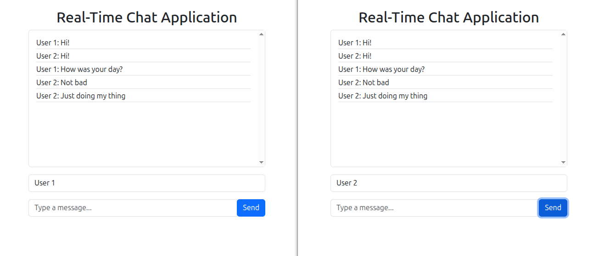

# Chat App

A real-time chat app that enables instant messaging between users with live message delivery.

## Technologies

### Backend (Server-side)

- Spring Boot
- Spring WebSocket
- spring Messaging (STOMP Protocol)
- Thymeleaf

### Frontend (Client-side)

- Thymeleaf
- JavaScript ES6
- Sock JS
- STOMP JS
- HTML / CSS
- Bootstrap

## How to use

``bash
git clone https://github.com/FacuBustamaante/chat-app
cd chat-app
code .
``

## Screenshot

